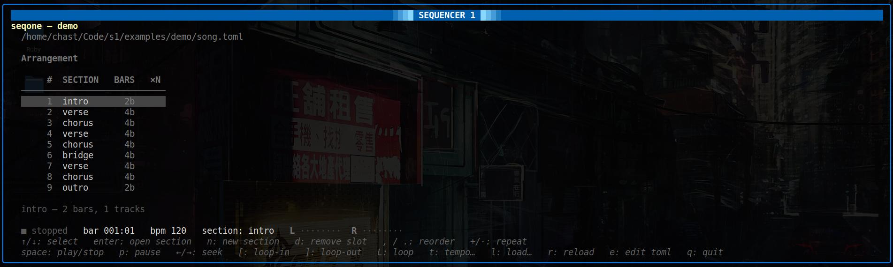

# seqone

A modern Linux spiritual successor to the Amiga **Sequencer One** — a
keyboard-driven, terminal-based MIDI + sample sequencer that reads and writes
plain-text song files.



## Why

Sequencer One had a beautifully direct horizontal "tracks across the screen"
layout that has aged better than most modern DAWs. `seqone` keeps that
aesthetic — tracks flow left-to-right across the arrangement timeline — but
runs in a terminal, drives RTP-MIDI and a built-in sample mixer, and stores
songs as text so they diff and version-control cleanly.

## Architecture

Two binaries, talking newline-delimited JSON over a Unix domain socket
(`$XDG_RUNTIME_DIR/seqoned.sock`):

- **`seqoned`** — engine daemon. Owns transport, the musical clock, the
  scheduler, the sample mixer (via miniaudio), and the optional RTP-MIDI
  sender.
- **`seqone`** — TUI client (Bubble Tea + Lip Gloss). Auto-spawns `seqoned`
  if it isn't already running.

Songs are plain text:

- **`song.toml`** — project metadata, samples, instruments, tracks,
  sections, arrangement.
- **`patterns/*.pat`** — one file per (section, track) clip; each is a row
  of cells where `.` is rest, `-` is tie, `X` is a sample trigger, and
  `C4` etc. are pitched notes (with optional `.vel`).

The text files are the source of truth; the TUI's editing wizards rewrite
them atomically and an fsnotify watcher reloads on external edits.

## Build

Requires Go 1.24+ and a C toolchain (the mixer uses cgo via `malgo`).

```sh
go build -o bin/seqone   ./cmd/seqone
go build -o bin/seqoned  ./cmd/seqoned
```

## Quick start

```sh
# scaffold a new project
./bin/seqone init mysong

# open it (engine auto-starts)
./bin/seqone --song mysong/song.toml
```

Or try the bundled demo:

```sh
./bin/seqone --song examples/demo/song.toml
```

## Running

The TUI has three modes:

- **arrangement** — section ribbon; reorder, repeat, add/remove sections.
- **section** — per-section tracks view with mute/solo, live monitor, and
  step-record.
- **pattern editor** — horizontal tracker grid; FastTracker-II keymap on
  the Z and Q rows for note entry, with audition.

A few headline keys:

| Key       | Action                                              |
|-----------|-----------------------------------------------------|
| `space`   | play / stop                                         |
| `←` / `→` | seek by bar                                         |
| `t`       | set tempo                                           |
| `l`       | load a song (with tab completion)                   |
| `e`       | open `song.toml` in `$EDITOR`                       |
| `enter`   | drill into section / open pattern editor            |
| `esc`     | back out a level                                    |
| `` ` ``   | toggle live monitor (then play notes from keyboard) |
| `R`       | toggle record (writes notes into the pattern)       |
| `q`       | quit                                                |

## RTP-MIDI

`seqoned` can send to an RTP-MIDI peer (e.g. macOS Audio MIDI Setup,
`rtpmidid`, an iPad):

```sh
./bin/seqoned -midi 192.168.1.10:5004
# or, when launching via the TUI:
./bin/seqone -midi 192.168.1.10:5004 --song mysong/song.toml
```

The implementation is pure Go (AppleMIDI session protocol + RFC 6295). It
is sender-only and does not yet implement journal recovery or mDNS
discovery.

## Status

Work in progress. The engine, scheduler, mixer, RTP-MIDI sender, song +
pattern format, scaffolder, and three-mode TUI (with live record and
audition) are all working. See `internal/` for the package layout.

## Layout

```
cmd/seqone     TUI client
cmd/seqoned    engine daemon
internal/
  engine       transport, clock, scheduler, socket server
  mixer        sample playback (malgo / miniaudio)
  protocol     line-JSON command + event types
  rtpmidi      AppleMIDI / RFC 6295 sender
  scaffold     `seqone init` project generator
  song         TOML + .pat parser, atomic mutators
  tui          Bubble Tea model, views, editor, watcher
examples/demo  bundled demo song
images/        reference screenshots of the original Sequencer One
```
